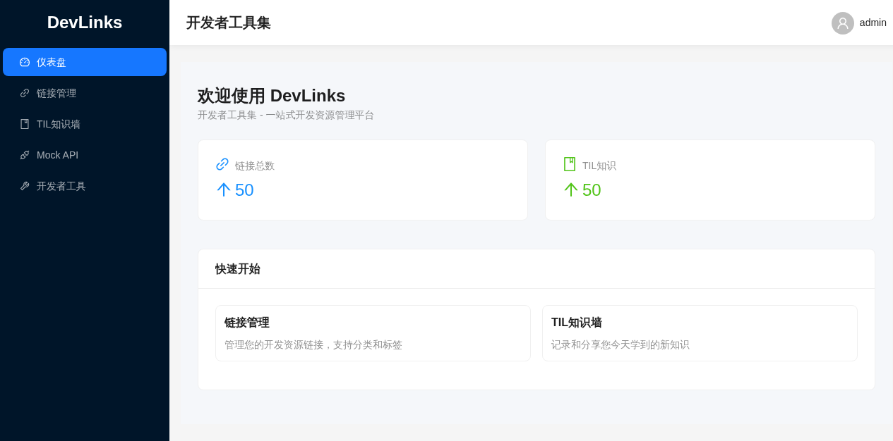
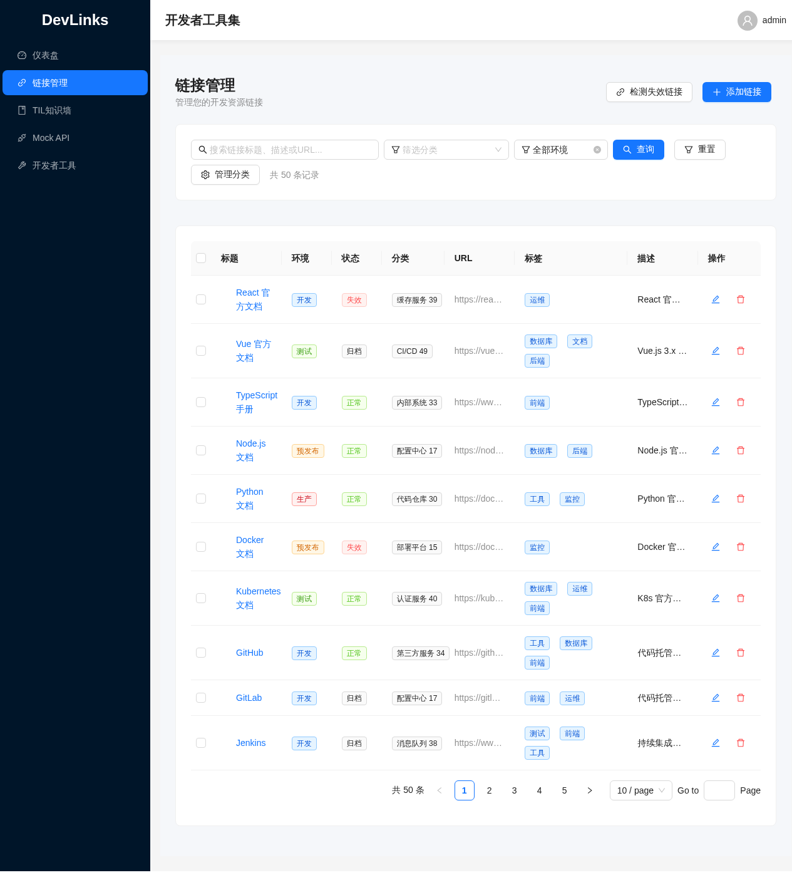
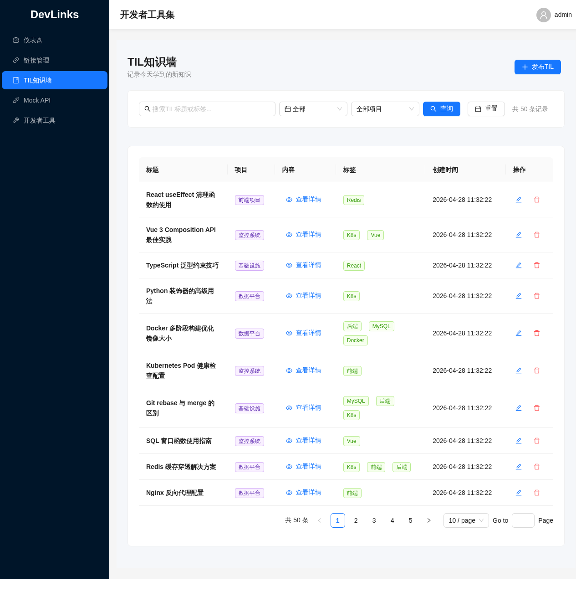
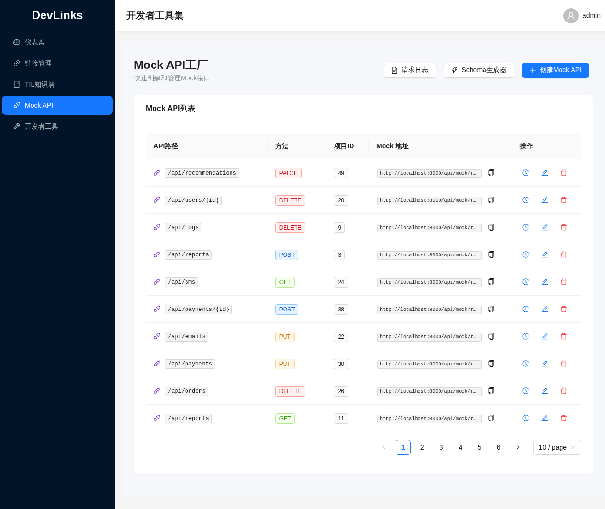
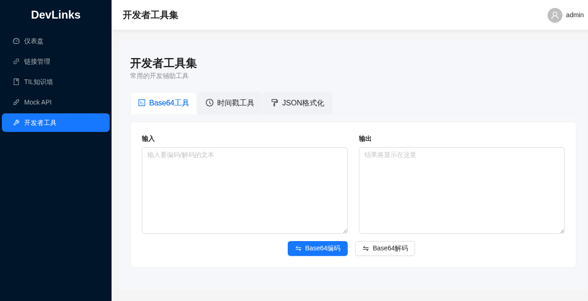
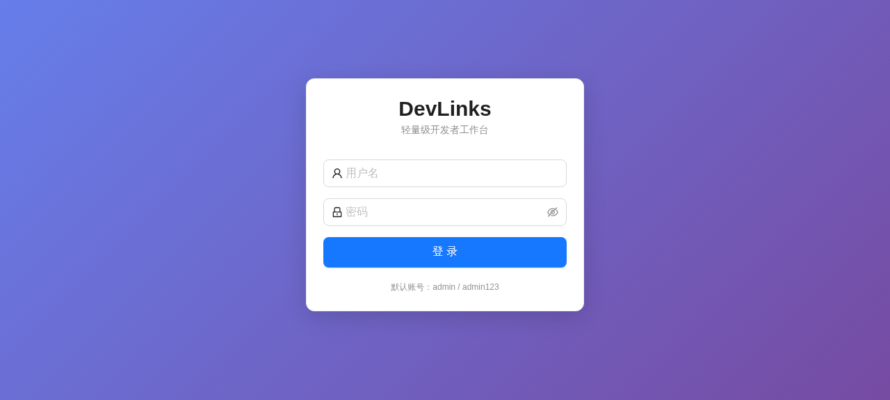

# DevLinks 🚀

> 轻量级开发者工作台 — 链接管理 · 知识沉淀 · Mock API · 实用工具

[](https://react.dev)
[](https://fastapi.tiangolo.com)
[](https://ant.design)
[](LICENSE)

---

## ✨ 功能

| 模块 | 说明 |
|------|------|
| 📌 **链接管理** | 分类存储、环境标记、失效检测、批量操作、标签筛选 |
| 📝 **TIL 知识墙** | Markdown 编辑、项目绑定、时间归档、点赞互动 |
| 🎭 **Mock API 工厂** | Schema 定义 → 动态 HTTP 接口、请求日志、Postman 导出 |
| 🔧 **开发者工具** | Base64 编解码、时间戳转换、JSON 格式化/压缩 |

## 📸 截图

| 仪表盘 | 链接管理 |
|:---:|:---:|
|  |  |

| TIL 知识墙 | Mock API 工厂 |
|:---:|:---:|
|  |  |

| 开发者工具 | 登录 |
|:---:|:---:|
|  |  |

## 🔥 亮点：Mock Server 动态接口

定义 JSON Schema 后，直接发 HTTP 请求获取假数据：

```bash
# 在 DevLinks 中创建 Schema，然后直接调用
curl http://localhost:8000/api/mock/run/my-project/api/users
# → { "data": [{ "id": 1, "name": "张三", "email": "zhangsan@example.com" }] }
```

- 支持 GET / POST / PUT / DELETE / PATCH
- 自动记录请求日志
- 一键导出 Postman Collection

## 🚀 快速开始

### Docker 一键部署（推荐）

```bash
# 配置环境变量
cp .env.example .env

# 启动
docker compose up -d
```

访问 http://localhost

### 手动启动

**后端**
```bash
cd devlinks-backend
python -m venv venv
source venv/bin/activate      # Windows: venv\Scripts\activate
pip install -r requirements.txt
python -m uvicorn app.main:app --host 0.0.0.0 --port 8000 --reload
```

**前端**
```bash
cd devlinks-frontend
npm install
npm run dev
```

访问 http://localhost:3000

### 默认账号

- 用户名：`admin`
- 密码：`admin123`

## 🛠 技术栈

| 层 | 技术 |
|---|------|
| **前端** | React 18 + Vite 5 + Ant Design 5 + React Router 6 |
| **后端** | Python 3.11+ / FastAPI / SQLAlchemy 2.0 / Pydantic 2.0 |
| **数据库** | SQLite（零配置，开箱即用） |
| **部署** | Docker / Docker Compose / Nginx |

## 🏗 项目结构

```
devlinks/
├── devlinks-frontend/     # React 前端
│   ├── src/
│   │   ├── pages/         # 页面组件
│   │   ├── services/      # API 封装
│   │   └── utils/         # 工具函数
│   ├── nginx.conf         # Nginx 反向代理配置
│   └── Dockerfile
├── devlinks-backend/      # FastAPI 后端
│   ├── app/
│   │   ├── api/v1/        # API 路由
│   │   ├── models/        # 数据库模型
│   │   ├── schemas/       # Pydantic 校验
│   │   ├── services/      # 业务逻辑
│   │   └── core/          # 核心配置
│   ├── startup.sh         # Docker 启动脚本
│   └── Dockerfile
├── screenshots/           # 项目截图
├── docker-compose.yml
└── .env.example
```

## 📄 License

MIT License © 2026 mongoby
